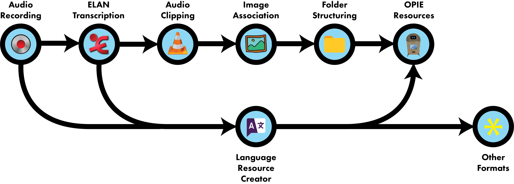
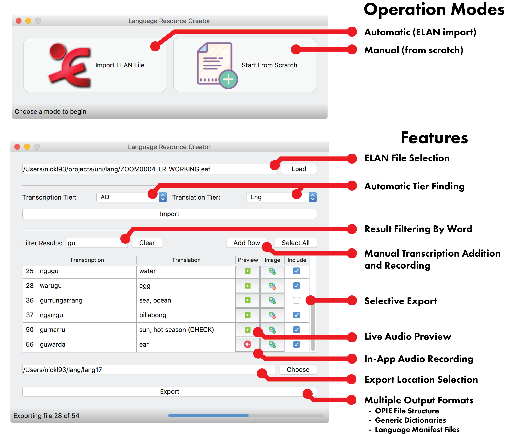

# Hermes: The Language Resource Creator 

Hermes is a user-friendly, cross-platform utility for turning [ELAN](https://tla.mpi.nl/tools/tla-tools/elan/) 
(*.eaf) linguistic analysis files and associated media into language resources.

This program can also be used to create language resources from scratch without an ELAN transcription file.

Hermes was developed by [Nicholas Lambourne](https://ndl.im) using Python3, PyQt5, pydub, and pygame as part of the
 [UQ Winter Research Scholarship Program](https://employability.uq.edu.au/winter-research). 
It is based on a proof-of-concept built by [Dr Gautier Durantin](http://gdurantin.com/).

It was originally created to produce language resources for the [NgukurrOPIE Project](http://www.itee.uq.edu.au/cis/opal/ngukurr) 
 at the [University of Queensland](https://uq.edu.au),
 which is developed in collaboration with the [Ngukurr Language Centre](http://www.ngukurrlc.org.au/) and
 the [Australian Research Council Centre of Excellence for the Dynamics of Language](http://www.dynamicsoflanguage.edu.au/).





## Usage Instructions
Instructions for using Hermes to produce language resources can be found [here](docs/README.md).

## Downloads (Dependency Free):

| MacOS  | Windows |
| ------ | ------- |
| [Link](https://www.dropbox.com/s/5lqk8tvqfjvyg4x/Hermes%20-%20The%20Language%20Resource%20Creator.app.zip?dl=1) | [Link](https://www.dropbox.com/s/qwg525k1k3zs1hn/Hermes%20-%20The%20Language%20Resource%20Creator.exe?dl=1) |


## Build Requirements:
- Python 3.6
- Git


## Install/Run Instructions:
### As a Script (Mac, Windows, Linux)
```bash
git clone https://github.com/CoEDL/hermes.git
cd hermes
pip3 install virtualenv
python3 -m venv venv
source venv/bin/activate
pip install -r requirements.txt
cd src
python3 main.py
```


### Build From Source
There is an MacOS build script included which can be run by:
```bash
git clone https://github.com/CoEDL/hermes.git
cd hermes
python3 build.py
```
If that fails, you can use the platform specific build instructions below.

#### Mac
```bash
git clone https://github.com/CoEDL/hermes.git
cd hermes
pip3 install virtualenv
python3 -m venv venv
source venv/bin/activate
pip install -r requirements.txt
pyinstaller main.spec --onefile --windowed 
```
The .app executable should appear in hermes/dist.

#### Windows
```bash
git clone https://github.com/CoEDL/hermes.git
cd hermes
python3 -m venv venv
venv\Scripts\activate
pip install -r requirements.txt
pyinstaller main.spec --onefile
```
The .exe file should appear in hermes\dist.


## Citations
This piece of software is the product of academic research at the University of Queensland by Nicholas Lambourne, Gautier Durantin and the CoEDL group. 
If you use the software or code in an academic setting, please be sure to cite it appropriately as follows:

> Lambourne, N. and Durantin, G. (2018). Hermes: The Language Resource Creator. The University of Queensland: Centre of Excellence for the Dynamics of Language.


## Acknowledgements
Images/Icons courtesy of [Icons8](https://icons8.com/icon/set/play/color).
