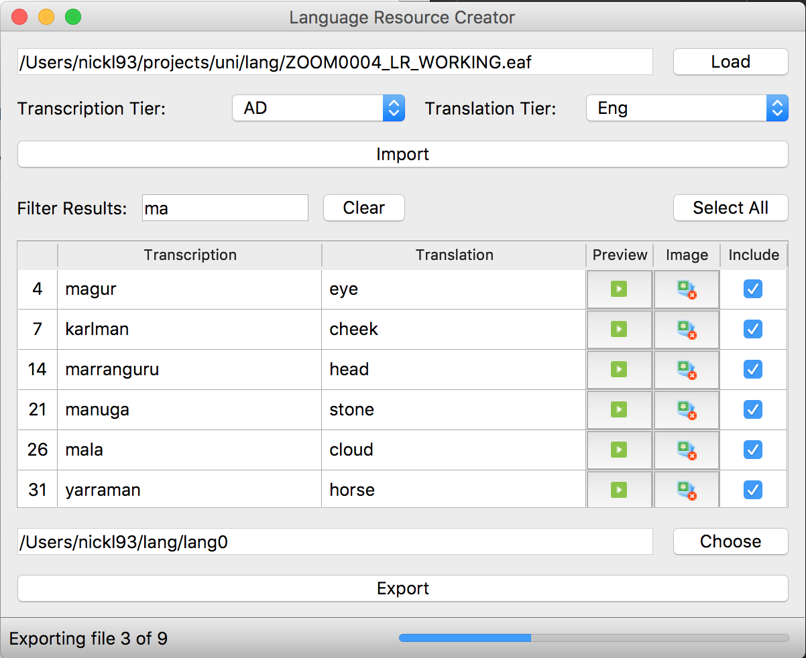

# ELAN Language Resource Creator
Cross-platform utility for turning ELAN (*.eaf) linguistic analysis files and associated media into language resources.

The Language Resource Creator was developed by [Nicholas Lambourne](https://ndl.im) using Python3, PyQt5, pymovie and pygame. 
It is based on a proof-of-concept built by [Dr Gautier Durantin](http://gdurantin.com/) as part of the [UQ Winter Research Scholarship Program](https://employability.uq.edu.au/winter-research).

Created primarily to produce language resources for the [Social Robot Project](http://www.itee.uq.edu.au/cis/opal/ngukurr) at the [University of Queensland](https://uq.edu.au), developed in collaboration with the [Ngukurr Language Centre](http://www.ngukurrlc.org.au/).

### Features:
- Media File Splitting & Export based on ELAN files
- Word-Image Association & Upload
- Live Previews of Audio Clips
- Transcription/Translation Search and Filter
- Editable Translations/Transcriptions



### Requirements:
- Python 3.6
- Git

### Install/Run Instructions:
#### As a Script
```bash
git clone https://github.com/nicklambourne/elan2resource.git
cd elan2resource
pip3 install virtualenv
python3 -m venv venv
source venv/bin/activate
pip install -r requirements.txt
cd src
python3 elan2resource.py
```

#### Build From Source
##### Mac
```bash
git clone https://github.com/nicklambourne/elan2resource.git
cd elan2resource
pip3 install virtualenv
python3 -m venv venv
source venv/bin/activate
pip install -r requirements.txt
pyinstaller elan2resource.spec --onefile --windowed 
```
The .app executable should appear in a new folder at the project root called build.

##### Windows
```bash
git clone https://github.com/nicklambourne/elan2resource.git
cd elan2resource\
python3 -m venv venv
venv\Scripts\activate
pip install -r requirements.txt
pyinstaller elan2resource.spec --onefile
```
The .exe file should appear in a new folder in elan2resource/build.

### Acknowledgements
Images/Icons courtesy of [Icons8](https://icons8.com/icon/set/play/color).
