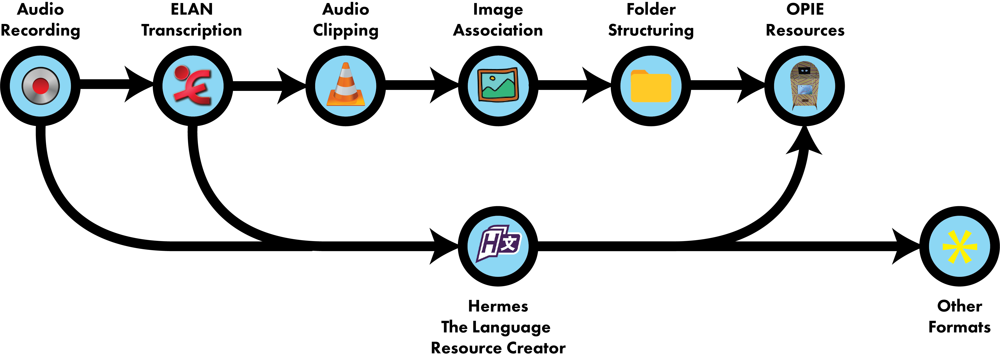

# Language Resource Creator 

Cross-platform utility for turning [ELAN](https://tla.mpi.nl/tools/tla-tools/elan/) (*.eaf) linguistic analysis files and associated media into language resources.

This program can also be used to create language resources from scratch without an ELAN transcription file.

The Language Resource Creator was developed by [Nicholas Lambourne](https://ndl.im) using Python3, PyQt5, pydub, and pygame as part of the [UQ Winter Research Scholarship Program](https://employability.uq.edu.au/winter-research). 
It is based on a proof-of-concept built by [Dr Gautier Durantin](http://gdurantin.com/).

Created primarily to produce language resources for the [Social Robot Project](http://www.itee.uq.edu.au/cis/opal/ngukurr) at the [University of Queensland](https://uq.edu.au), developed in collaboration with the [Ngukurr Language Centre](http://www.ngukurrlc.org.au/).

.

Created primarily to produce language resources for the [Social Robot Project](http://www.itee.uq.edu.au/cis/opal/ngukurr) at the [University of Queensland](https://uq.edu.au), developed in collaboration with the [Ngukurr Language Centre](http://www.ngukurrlc.org.au/).




## Down](docs/img/process-flow.png)


## Downloads (Dependency Free):

| MacOS  | Windows |
| ------ | ------- |
| [Link](https://www.dropbox.com/s/bps2auxy4plwrif/Language%20Resource%20Creator.app.zip?dl=1) | [Link](https://www.dropbox.com/s/rs3g7ps05w2rqxl/Language%20Resource%20Creator.exe?dl=1) |


## Build Requirements:
- Python 3.6
- Git


## Install/Run Instructions:
### As a Script (Mac, Windows, Linux)
```bash
git clone https://github.com/nicklambourne/elan2resource.git
cd elan2resource
pip3 install virtualenv
python3 -m venv venv
source venv/bin/activate
pip install -r requirements.txt
cd src
python3 main.py
```


### Build From Source
There is an MacOS build script included which can be run by:
```bash
git clone https://github.com/nicklambourne/elan2resource.git
cd elan2resource
python3 build.py
```
If that fails, you can use the platform specific build instructions below.

#### Mac
```bash
git clone https://github.com/nicklambourne/elan2resource.git
cd elan2resource
pip3 install virtualenv
python3 -m venv venv
source venv/bin/activate
pip install -r requirements.txt
pyinstaller main.spec --onefile --windowed 
```
The .app executable should appear in elan2resouce/dist.

#### Windows
```bash
git clone https://github.com/nicklambourne/elan2resource.git
cd elan2resource
python3 -m venv venv
venv\Scripts\activate
pip install -r requirements.txt
pyinstaller main.spec --onefile
```
The .exe file should appear in elan2resource\dist.


## Acknowledgements
Images/Icons courtesy of [Icons8](https://icons8.com/icon/set/play/color).
