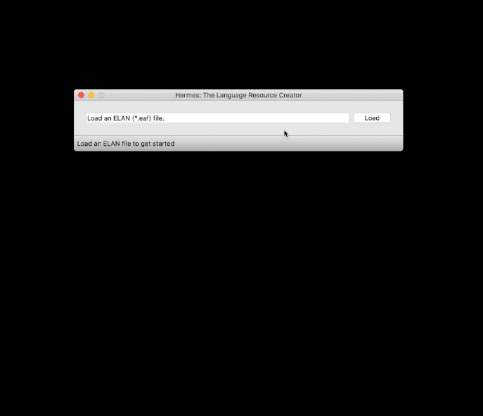
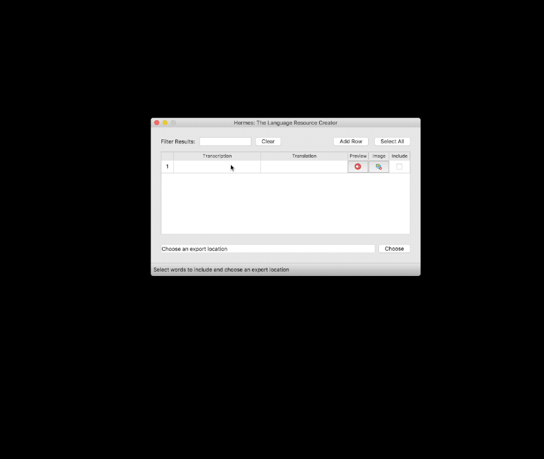

# Using Hermes to Create Resources 

## Default Project Directories
By default Hermes will create a project folder in the follow locations:
    - Windows: Documents\Hermes\Projects (or My Documents\Hermes)
    - MacOs: {User_Name}\Hermes\Projects (ie. your default Home drive, opening Finder will open the root home directory)
    - Linux: ~\Hermes\Projects

## Starting a new Project

1. Launch Hermes, you will now see the main menu.
2. Click on the 'Start New Project' button.
3. Fill in your project details (Project Name, Transcription Language, Translation Language, Author)
4. Choose either 'Import ELAN File' to import an annotated ELAN file or 'Start From Scratch' to start an empty project.

## Creating Resources from an ELAN (*.eaf) File (Import ELAN File option)

1. Click the 'Load' button and use the file window that opens to select the
ELAN file you would like to create resources from.
2. Hermes will automatically parse the ELAN file and provide you with a selection
of tiers from which to choose your transcription and translation tiers. When you
are satisfied with your selection, click the import button.
3. A table will appear, populated with the transcriptions, translations and buttons
for previewing audio.
    - If you would like re-record audio for any transcription, right-click the preview
    button for that line, a recording window will appear. You can change the recording
    microphone in the Settings/Preferences Menu (⌘ + B).
    - If you would like to associate an image with a transcription, left-click the image
    icon.
    - Transcription and translation text is editable and can be changed before exporting.
4. Click the appropriate 'Include' checkboxes for any transcriptions you would like to
include in the exported resources. You can also click the 'Select All' button.
6. When you have selected all of the transcriptions you require, click the 'Choose' button
to select an output location, by default the project's export folder will be set, but we 
recommend you create a sub-folder by clicking 'Choose'.
7. Once you have selected a valid output location an export button should appear. Click it
to begin the export process.
    -  If you want to change the output format (OPIE, JSON, CSV), you may do so in the
    Settings/Preferences menu, which is accessible from the toolbar or via (⌘ + B).
    -  Exporting to the LMF (JSON) format will prompt you for additional information about the
    transcription and translation languages, as well as the resource author.

## Creating Resources from Scratch (Start From Scratch option)

1. Input transcriptions and translations as required.
    - New rows for transcriptions/translations can be added by clicking the 'Add Row'
    button, through the toolbar's 'Table' meny or by using the shortcut (⌘ + N).
    - You can record audio for each transcription by left or right-clicking the button
    in the 'Preview' column, which will open the recording window.
    - Images can be associated with each transcription by clicking the button in the
    'Image' Column
2. Click the appropriate 'Include' checkboxes for any transcriptions you would like to
include in the exported resources. You can also click the 'Select All' button.
3. When you have selected all of the transcriptions you require, click the 'Choose' button
to select an output location.
4. Once you have selected a valid output location an export button should appear. Click it
to begin the export process.
    -  If you want to change the output format (OPIE, JSON, CSV), you may do so in the
    Settings/Preferences menu, which is accessible from the toolbar or via (⌘ + B).
    -  Exporting to the LMF (JSON) format will prompt you for additional information about the
    transcription and translation languages, as well as the resource author.

### Note: Installing the FFMPEG Plugin
- By default, Hermes only includes support for WAV audio.
If you need to work with other formats, please install the FFMPEG plugin
in the settings menu.

## Saving your Progress
1. Click on 'File' in the menu toolbar.
2. Click on 'Save Project' and hermes will record your data.
    - By default this will be in your projects directory under {Project_Name}/saves, called {Project_Name.hermes}.

## Opening an existing project
1. Click on 'File' and 'Open Project' in the menu toolbar.
2. A file dialogue will now open in your default projects directory root. By default this is in:
    - Windows: Documents\Hermes\Projects
    - MacOS: {user_name}\Hermes or ~\Hermes (Where ~ is your home directory)
    - Linux: ~\Hermes
3. If there is data in this project, Hermes will populate the transcription table which will now appear.
4. If there is no data, then a blank transcription table will open.

## Creating Templates
1. Fill in the hermes table either through importing an ELAN file or starting from scratch.
2. Click on Templates in the menu toolbar.
3. Click on Create Template.
4. Name your template in the appropriate entry field.
5. Tick the checkbox to indicate which columns (Either Transcription, or Translation) you want to use
for the template. You may choose both if relevant.
6. Click 'OK' to create the template, 'Cancel' if you no longer wish to create a template.
    - Templates can be found in your {Project_Name}/Templates folder where your default project directory is set.

## Loading Templates
1. Click on 'Templates' in the menu toolbar.
2. Click on Load Template, the default template folder for your project will open.
3. Select the appropriate template (.htemp) file to load.
4. Hermes will automatically populate the table based on this file, ready for you to attach images and
record audio for the word list.
